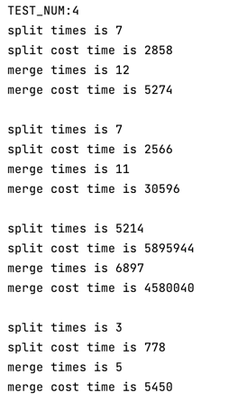
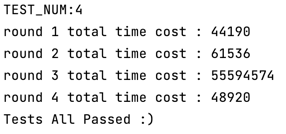
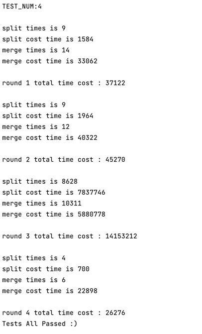
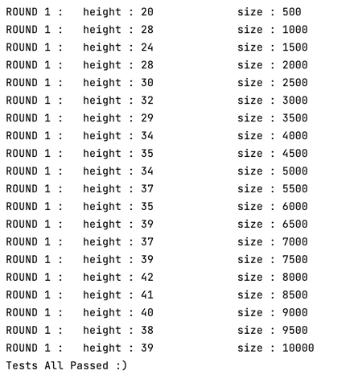
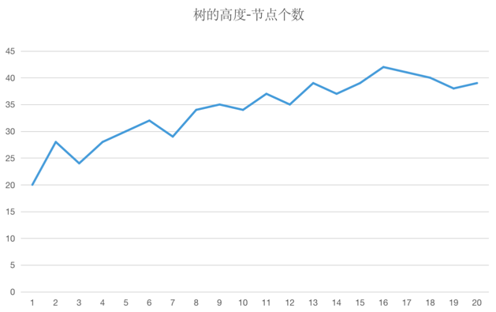

# [lab1 无旋Treap (click me)](https://github.com/dancingDora/fhq_treap)
## 开放性问题
### 性能分析
#### 方法 : rdtsc(pdf中方法)
DETAILS ： 
* 在`class Treap`中新增了`public : int mergeTime, mergeNum, splitTime, splitNum`
* `mergeNum, splitNum`用来计算非`merge(), split()`中，调用`merge()`和`split()`的次数。
* 看`split`和`merge`操作在全部时间中占比
#### 生成结果（不准确）

**merge split时间开销**


**总时间**


|     test case     | split | split time | merge | merge time | total time |
|:-----------------:|:-----:|:----------:|:-----:|:----------:|:----------:|
|      case 1       |  12   |    5274    |   7   |    2566    |   44190    |
|      case 2       |   7   |    2566    |  11   |   30586    |   61536    |
|      case 3       | 5214  |  5895944   | 6897  |  4580040   |  55594574  |
| case same element |   3   |    778     |   5   |    5450    |   48920    |
#### 结果修正 
**merge 和 split 在总时间中占比不及预期，发现是在计算总时间将文件读写时间开销算入。**

重新计算总时间后结果如图所示 : 


|     test case     | merge | merge time | split | split time | total time |  rate  |
|:-----------------:|:-----:|:----------:|:-----:|:----------:|:----------:|:------:|
|      case 1       |  14   |   33062    |   9   |    1584    |   37122    | 93.33% |
|      case 2       |  12   |   40322    |   9   |    1964    |   45270    | 93.41% |
|      case 3       | 10311 |  5880778   | 8628  |  7837746   |  14153212  | 96.93% |
| case same element |   4   |    700     |   6   |   22898    |   26276    | 89.81% |
#### 结论
* 分裂和合并操作的时间占比约为95%及以上。
* 平均每种运算要进行1.6次merge操作和1.2次split操作（有split必有merge，不过有merge不一定会有split）
* 在每个节点count大多非1时，split操作相对而言会执行更多。
### KeySize - Height
#### 实现
更新节点个数函数`update()`在维护size的同时另外以相同的思路维护树高
```c
    void update(TreapNode<T> *x) {
        int ll = (x->left) ? x->left->size : 0;
        int hll = (x->left) ? x->left->height : 0;
        int hrr = (x->right) ? x->right->height : 0;
        int rr = (x->right) ? x->right->size : 0;
        x->height = max(hll, hrr) + 1;
        x->size = ll + rr + x->count;
    }
```
#### 测试
##### 测试数据取值说明
* 测试数据共20组 , 插入随机数 , 较多组数据更容易展示图表细节
* 插入集范围为`[500, 10000]`
  * {500， 1000， 1500， 2000 ... ... 10000}
* 数据范围呈线性增长，使图像更易于观看理解 
* 数据范围涵盖`1000～10000`相差十倍，不仅可以更容易展示出呈对数发展的趋势 , 也是为了更容易展示图表细节
##### 测试函数
```c
    string filename = "./analyse/test";
    
    for(int i = 1; i <= 20; i++) {
        filename = "./analyse/test";
        filename += to_string(i);
        int n = 500 * i;
        int a,b;
        ifstream fin(filename);
        for(int j = 1; j <= n; j++) {
            fin >> a >> b;
            treap.insert(b);
        }
        cout << "ROUND 1 :\theight : " << treap.height() << "\t\t\tsize : " << n << '\n';
    }
std::cout << "Tests All Passed :)" << std::endl;
return 0;
```
##### 测试结果



##### 绘制图表


* 纵坐标 : treap高度
* 横坐标 : key个数(*500)
##### 结论

* 大体成对数函数关系 `H = log(Key)`
* 由此可以推算得知树的插入删除搜索操作时间复杂度均为`O(logn)`
* 并且treap同时满足二叉搜索树与堆的性质，既可以使其成为二叉搜索树，又可以用随机的方式，通过堆的性质防止某些顺序比较整齐的数据严重破坏树的平衡性

## 运行指南
### .PDF version
* 目录ads-lab1
```
make build

make run
```
### CLion version(CMakeLists.txt)
* 编辑配置
* 配置工作目录(包含data文件夹最小文件夹，即`ads-lab1`)、可执行文件(`dir : cmake-build-debug/executable`)
* `test.cc` `line 9`关掉注释
* run : `ctrl + R`
### Terminal version
* 目录ads-lab1
```
make

./build/executable
```